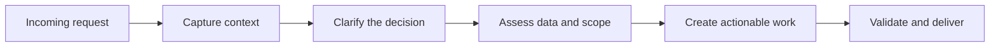

import SlackSimulation from '@site/src/components/SlackSimulation';
import Tabs from '@theme/Tabs';
import TabItem from '@theme/TabItem';

# The Triage 🔍

---

Let's be real. Data work rarely starts in a pristine SQL editor. 

It starts in a message, a ticket, an issue, or a conversation where the business context is incomplete and the urgency is real.

This page shows how I think about intake before analysis begins: identify where the request came from, expose what is missing, and turn an informal ask into work that can be scoped, modeled, validated, and delivered.

<SlackSimulation />

## The Intake Pipeline

Requests often change shape based on the channel they arrive through, but the operating response stays consistent:

- preserve the original business language
- identify the decision the request is meant to support
- make metric definitions, scope, timing, and ownership explicit
- separate discovery from build work
- create a traceable handoff into data, analytics, or reporting

{/* 

<Tabs groupId="intake-channels" queryString="channel">
  <TabItem value="slack" label="Slack" default>

**Incoming request**

> “Hey, quick question, can we pull a report on why support tickets spiked yesterday?”

**What is missing**

- What counts as a support ticket?
- Which queues, products, or regions are in scope?
- Is “spike” compared with the previous day, a weekly baseline, or a forecast?
- Does the requester need a count, a cause, or an action recommendation?

:::warning Hidden trap
The urgency and conversational tone can make a broad diagnostic request look like a simple one-off report.
:::

**First handoff**

Capture the request, define the comparison period and population, then route the clarified question into source-data and metric validation.

  </TabItem>
  <TabItem value="jira" label="Jira">

**Incoming request**

> “Create a dashboard for account manager capacity.”

**What is missing**

- How is capacity defined: headcount, available hours, workload, or portfolio complexity?
- Who will use the dashboard and what decision will it support?
- What grain is required: account, manager, team, queue, or reporting period?
- Which existing operational definitions should be preserved?

:::warning Hidden trap
A large ticket can contain several products: metric definition, data modeling, dashboard design, validation, and rollout.
:::

**First handoff**

Break the request into discovery, modeling, reporting, and validation work before estimating delivery.

  </TabItem>
  <TabItem value="github" label="GitHub or Email">

**Incoming request**

> “The weekly customer metrics look wrong. Can someone check the data?”

**What is missing**

- Which metric changed and what does “wrong” mean?
- When did the behavior begin, and what changed around that time?
- Is the issue in the source data, transformation logic, definition, or reporting layer?
- Who can confirm the expected result?

:::warning Hidden trap
Technical channels often identify a symptom without carrying the operational context needed to define the correct fix.
:::

**First handoff**

Preserve the evidence, identify the affected model or report, and pair the technical investigation with an accountable business owner.

  </TabItem>
  <TabItem value="direct" label="Direct Request">

**Incoming request**

> “Can you show leadership how the team is performing?”

**What is missing**

- Which team, period, and outcomes are in scope?
- Which performance measures are trusted today?
- Is the audience looking for monitoring, diagnosis, forecasting, or a decision?
- What action should the report make easier?

:::warning Hidden trap
Senior audiences may ask for a broad view while still expecting a precise recommendation.
:::

**First handoff**

Translate the broad request into an agreed decision, audience, measures, and delivery format before touching the data.

  </TabItem>
</Tabs>

 */}

## From Message to Actionable Work

{/* Here is an illustrative example of how an incomplete request becomes an executable workstream. The model names below are examples of a possible implementation, not claims about models currently in this repository.

### Incoming request

> “Can you look into why customer success metrics look weird this week?”

### Diagnostic triage

Before writing a query, I would clarify:

- Which customer success metrics are affected?
- What changed, when did it change, and what is the comparison baseline?
- Is the issue visible in the source data, the transformation layer, or the BI output?
- Which customer segments, teams, queues, or regions are affected?
- Who owns the expected definition and can validate the result?

## From Message to Work: An Interactive Triage Example */}

Here is how an ambiguous, frontline request moves through a structured diagnostic lens before any technical work begins.

<Tabs>
  <TabItem value="incoming" label="💬 1. The Incoming Ask" default>
    > **Slack / 9:14 AM:** 
    > *"Hey team, can someone look into why customer success metrics look weird this week? Escalations seem high, but ticket closure rates look totally off compared to last month."*
    
    **The Challenge:**

    High urgency, vague baseline comparisons ("look weird"), and mixed symptom signals that span multiple teams and systems.
  </TabItem>

  <TabItem value="verification" label="🔍 2. Visual & Filter Check">
    ### Before touching the data stack, verify the user's screen state:
    **UI & Filters:** 
    Ask what exact filters, date toggles, or regional views are currently applied on their dashboard. 
    
    **Screenshots:** 
    Request a quick screenshot to confirm whether we are staring at the same baseline—or if a rogue legacy filter is skewing their view.
    
    **Result:** 
    Instantly rules out UI artifacts or unapplied filters in two minutes, saving hours of unnecessary technical investigation.
  </TabItem>

  <TabItem value="triage" label="⚙️ 3. Diagnostic Triage">
    ### Probing to isolate the operational gap:
    **Scope & Baseline:** 
    Which exact customer success metrics are shifting, and what is the proper comparison baseline?
    
    **Layer Isolation:** 
    Is the anomaly originating in source telemetry (how tickets are logged), transformation models, or the final BI view?
    
    **Ownership:** 
    Who owns the business definition of an "escalation," and who validates whether the findings represent a real operational shift?
  </TabItem>

  <TabItem value="workstream" label="📈 4. The Action Plan">
    ### Structured Multi-Domain Workstream:
    **Data Engineering & Sources:**
    Audit raw ingestion logs and null-handling to check if telemetry data dropped.
    
    **Data Modeling & Analytics:**
    Trace transformation logic to differentiate true customer escalations from automated routing rules or bulk re-assignments.
    
    **Reporting & Enablement:**
    Partner with operations leadership to document definitions, clarify what leadership needs to act on, and adjust the view.
  </TabItem>
</Tabs>

{/* ### Structured delivery plan

**Epic:** Customer Success Queue Re-alignment

| Workstream | Example deliverable | Decision it supports |
| --- | --- | --- |
| Data engineering | Audit null handling and source completeness in support-ticket logs | Can the source data support a reliable metric? |
| Analytics | Build an intermediate model isolating true escalation triggers from routine touchpoints | What is actually driving the change? |
| Reporting | Deliver an executive capacity and trend view with definitions and validation notes | What should leadership do next? | */}

{/* The point is not to turn every message into bureaucracy. It is to create just enough shared structure that the eventual analysis answers the right question and can be trusted by the people using it. */}

## The Handoff Standard

A request is ready to enter build work when the team can answer:

- **Decision:** What decision will this work support?
- **Scope:** Which population, period, and operational context are included?
- **Definition:** What does each metric mean, and what is the grain?
- **Evidence:** Which source tables, models, or reports will be assessed?
- **Owner:** Who can confirm that the result is correct and useful?
- **Outcome:** What will be delivered, and how will success be validated?

For the next step in the process, see [Navigating Stakeholder Ambiguity](request-vs-reality), which covers the diagnostic questions used when the original request is unclear.
