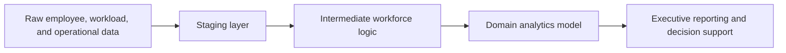

  
Featured case study

  

  

    I built a workforce intelligence model that connected employee hierarchy, workload patterns, and operational performance to create a clearer view of staffing health, capacity risk, and business impact.
  

  
Sprint Delivery Timeline

  
Agile Project Delivery Roadmap

  

    
Sprint 1: Foundations

    
Schema Audit &amp; Staging Models

    
dbt Schema Testing &amp; Validation

    
Sprint 2: Capacity &amp; Workload Model

    
Employee Hierarchy SQL (CTEs)

    
Capacity &amp; Workload Model

    
Sprint 3: Executive BI

    
Looker Studio Dashboard Design

    
Executive Review &amp; Automated Refresh

  

  

    2026-10-05
    2026-10-10
    2026-10-15
    2026-10-20
    2026-10-26
    2026-11-08
  

## Overview

This project was designed to turn fragmented workforce and operational data into a decision-ready model. The goal was to connect staffing structure, workload patterns, and business performance so leaders could understand where capacity was constrained and where operational improvements could produce measurable value.

The result was a practical analytics foundation that supports executive reporting, operational decisions, and workforce planning across teams.

## Business challenge

The organization had access to employee records, workload information, and operational metrics, but these signals were disconnected and difficult to interpret at the team level. Without a connected view, it was hard to answer questions such as:

- Are teams over or under capacity?
- Where are staffing gaps affecting service or delivery?
- Which teams are carrying disproportionate workload?
- How much operational inefficiency is created by fragmented reporting and manual analysis?

That gap created reporting overhead, slow decision-making, and limited visibility into workforce health.

## My approach

I designed a layered data model that converted raw operating data into a more usable workforce intelligence structure.

### 1. Raw source data

The raw inputs included employee hierarchy, workload data, and operational records. The first step was to normalize those sources so employee IDs, dates, and core business dimensions were consistent across the system.

### 2. Staging layer

I standardized and cleaned the raw tables so the business logic could operate on a trustworthy foundation. This included consistent field casting, naming, date handling, and filtering for noisy or incomplete records.

### 3. Intermediate layer

This layer brought together the relationships that matter most: employee hierarchy, team structure, workload patterns, and operational indicators. It served as the bridge between raw tables and business decisions.

### 4. Domain layer

The domain layer created the business-facing output: a cleaner analytical model that could support capacity analysis, workforce planning, and executive reporting.

## Data flow

This architecture made the logic easier to understand, easier to maintain, and more dependable for leadership use.

## Business value

The value of this work was not only the model itself. It created a more disciplined operational narrative:

- capacity risks became visible earlier
- manual reporting effort dropped significantly
- workforce health became easier to evaluate
- decisions were supported by a clearer and more consistent source of truth

### Example outcomes

- Reduced operational reporting time from several days to a near-real-time workflow
- Improved visibility into workforce capacity and utilization
- Identified where staffing structure and workload demand were misaligned
- Created a repeatable model for future business questions and reporting needs

## Technical pattern used

The architecture followed a simple but scalable flow:

1. Raw source data
2. Staging and normalization
3. Intermediate logic and relationships
4. Business-ready domain models
5. Reporting and operational decision support

This structure is especially useful for analytics work where clarity, governance, and maintainability matter as much as the final output.

## Tools and systems

- SQL
- BigQuery
- Data modeling
- Workforce analytics
- Operational reporting
- Business intelligence workflow design

## Summary

This case study demonstrates how raw workforce and operational datasets can be transformed into a practical analytics foundation for leadership decision-making. The core outcome was not simply a dataset, but a clearer operating picture of how people, workload, and performance fit together.

That is what made the project valuable: it translated fragmented data into business understanding.

